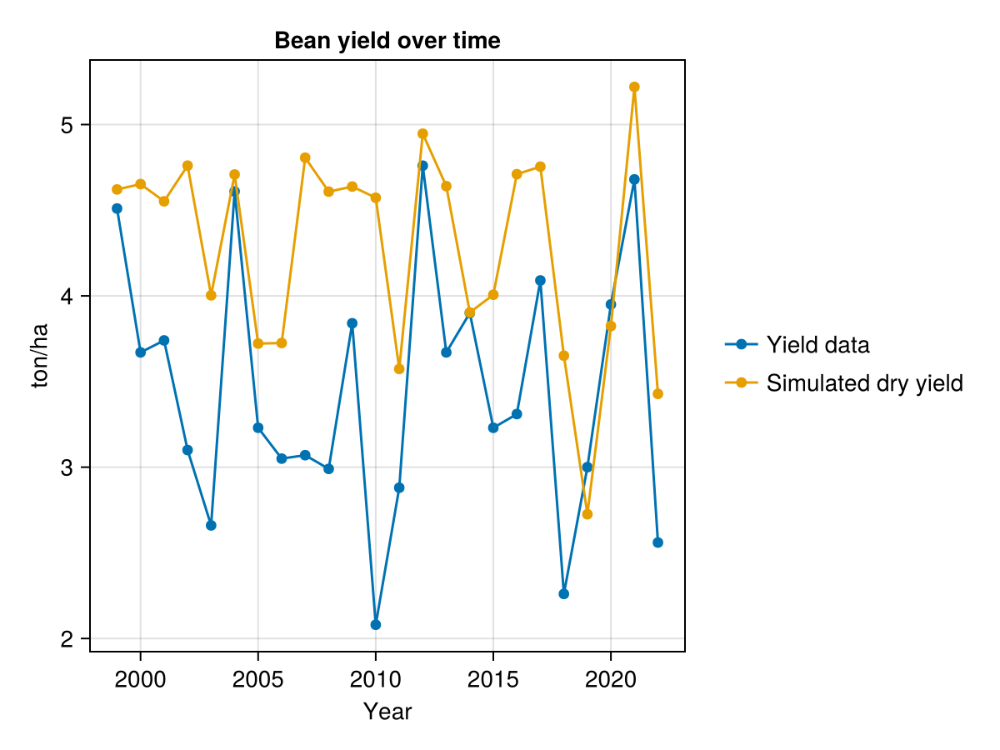

# Summary

[AquaCrop](https://www.fao.org/aquacrop/en/) is a simulation model that forecasts
the growth and yield of crop plants under different environmental and management
conditions. As a process-based model, it can be used to optimise farm management, 
forecast regional yields, or study climate change impacts and sustainable farming 
practices. Originally developed by the Food and Agricultural Organization of the 
United Nations (FAO), it has been widely applied in agricultural research.

Here, we present an expanded reimplementation of the model in Julia [@Bezanson2017], 
focussing on improving its interoperability with other software and models. With 
`AquaCrop.jl`, we want to make AquaCrop available to the growing number of environmental
modellers working in Julia, and contribute to the creation of integrated, 
interdisciplinary models in the environmental sciences.

# Statement of need

All agriculture is dependent on the growth of plants. Crop plants provide food
for humans, fodder for domestic animals, and fibre and other resources for our
manufacturing economy. Therefore, understanding how plants grow under different
conditions is important not just for farmers, but also for the rest
of society. This is particularly true in light of the major challenges associated with
malnutrition and agriculture-related environmental degradation, both of which require
wide-ranging changes to our food systems [@Foley2011]. In this context, crop models 
that are based on physical and physiological processes can be used to inform 
decision-making. These models use information about environmental parameters (e.g. 
temperature, rainfall, soil quality) and knowledge of plant biology to simulate how 
crop plants grow over time and estimate the resulting yield.

As one such model, AquaCrop was developed with a special emphasis on the role
of water for crop growth, and intended to be both simple and robust [@Steduto2009].
It has been used to model numerous crops worldwide [@Mialyk2024], and is known to
produce reliable estimates of crop phenology and yield [@Kostkova2021]. First
implemented in Delphi, it was later open-sourced in a Fortran version [@deRoos2021; 
@RSDA2024]. There are also versions available in [Matlab](https://github.com/aquacropos/aquacrop-matlab),
[Python](https://github.com/aquacropos/aquacrop), and [R](https://github.com/jrodriguez88/aquacrop-R),
although currently these are not up-to-date with the most recent version of the original model 
[@Foster2017; @Kelly2021; @CamargoRodriguez2019]. 

`AquaCrop.jl` expands this portfolio to contribute to the emerging ecosystem of
environmental research software in Julia. To our knowledge, this is the first 
process-based crop model available in this language. In addition, our purpose is also 
to provide a package that can be readily integrated into other scientific software. 
Recent research has emphasised the need for the creation of interdisciplinary models 
that address the multifaceted processes underlying global challenges, such as climate 
change or biodiversity loss [@Cabral2023]. This will require the use of model coupling
and the adaptation of existing models to be usable as components in integrated models 
[@Vedder2024].

Specifically, we developed the package to use it as a component within 
[`Persefone.jl`](https://persefone-model.eu), a process-based model of agricultural 
ecosystems [@Vedder2024a]. The aim of this model is to study the impact that 
agricultural management and policy has on biodiversity, for which the growth of 
crop plants is an important mediating factor.

# Comparison to original implementation

The core code of `AquaCrop.jl` closely follows the FAO's Fortran implementation, 
which allows us to quickly integrate changes and updates to the original `AquaCrop` 
code. The code was translated verbatim as much as possible, leaving all function and
variable names as they are. To maintain compatibility, we also support the original 
(highly idiosyncratic) input file formats. The correctness of our code is tested 
by comparing its output with that of the original software, to ensure that it 
produces the same results.

Whereas the original software was primarily designed as a stand-alone model, our
purpose is to use `AquaCrop.jl` as an integrated component. Therefore, we developed
a wrapper layer with an API that improves the package's interoperability. First, we 
added support for standardised input and output file formats (TOML and CSV), and for
loading input data from memory rather than disk (for example using output from a
coupled model). Second, we bundled all state variables for a simulation in one 
struct (`AquaCropField`), thereby eliminating global state and allowing multiple 
simulations to be carried out in parallel, as well as making serialisation and data 
transfer easier. Third, and most importantly, we enabled the model to be run 
dynamically. Rather than simply being executed as a batch job, the simulation can 
 be advanced one day at a time, allowing state variables to be inspected and changed on the go.
This makes it possible to use the package for dynamic, bidirectional model coupling as
well as interactive use.

Overall, our aim was to leave the scientific core of the model unchanged, but to
make it as easy as possible for environmental modellers using Julia to integrate
into their own software. One side benefit of this is that our package can of course
be complemented with other libraries from the Julia ecosystem, giving access to other
high-quality research software such as the EcoJulia collection, and utility packages 
such as [`Makie.jl`](https://makie.org/website/) [@Danish2021], 
[`StatsModels.jl`](https://juliastats.org/StatsModels.jl/stable/), or 
[`Optimisers.jl`](https://fluxml.ai/Optimisers.jl/stable/). Another benefit is that 
modellers who wish to expand or otherwise modify the scientific core of `AquaCrop` 
can now do so in Julia rather than Fortran, if they are unfamiliar with the latter.

# Examples 

The following tutorials are provided in the documentation:

- [Basic run](https://gabo-di.github.io/AquaCrop.jl/dev/gettingstarted/#basic_run_section) 
shows how to set up a model run using the original `AquaCrop` configuration file format, 
simulating a complete vegetation period in one go.
- [Intermediate run](https://gabo-di.github.io/AquaCrop.jl/dev/userguide/#Intermediate-Run) 
shows how to configure the model with TOML and CSV files, how to advance the simulation
one day at a time, and how to access crop variables at run time.
- [Advanced run](https://gabo-di.github.io/AquaCrop.jl/dev/userguide/#Advanced-Run) 
shows how to configure the model via the API (i.e. using Julia variables), and how to
change variables at run time.

A simple demonstration of a basic run using the data from the `AquaCrop.jl/test/testcase` 
directory is shown here:


```julia
using AquaCrop
using CairoMakie
using Unitful


# First, we specify the input file format:
# NormalFileRun(): use the original AquaCrop file format
# TomlFileRun(): use TOML and CSV formatting
# NoFileRun(): provide input data via the API
runtype = NormalFileRun();

# Then specify the directory containing the necessary input files
parentdir = AquaCrop.test_dir;  # ".../AquaCrop.jl/test/testcase"

# Now we can do a simulation run and plot the results
outputs = basic_run(; runtype=runtype, parentdir=parentdir);
function plot_basic_out(cropfield, cols)
    x = cropfield[!, "Date"]
    aux_sz = round(Int, sqrt(length(cols)))
    f = Figure()
    for (i, coli) in enumerate(keys(cols))
        ii, jj = divrem(i-1, aux_sz)
        ax = Axis(f[ii, jj],
                title = cols[coli][1],
                xlabel = "Date",
                ylabel = cols[coli][2]
                )
        lines!(ax, x, ustrip.(cropfield[!, coli]))
        ax.xticklabelrotation = π/4
        ax.xticklabelsize = 8
        ax.yticklabelsize = 8
    end
    return f
end

f = plot_basic_out(outputs[:dayout], 
    Dict("CC"=>["Canopy Cover","%"], 
         "Tavg"=>["Temperature","K"],
         "Biomass"=>["Biomass","ton/ha"],
         "Rain"=>["Rainfall","mm"]))
```


The resulting graph is shown in \autoref{fig:biomass}. Biomass increases over the
growing season, is then reset to 0 with the harvest, and then sown again the
following spring.

\autoref{fig:beans} displays the results a more realistic use case. Here, 
`AquaCrop.jl` was used to simulate the growth of beans (*Vicia faba*) based on 
environmental data from Thuringia, Germany, with historical yield data shown 
for comparison (data not shown). This showcases that when well parameterised, 
`AquaCrop.jl` forecasts the development of yields over time quite reliably.



# Acknowledgements

GDI, MM, and DV are funded through the project CAP4GI by the Federal Ministry of 
Education and Research (BMBF), within the framework of the Strategy, Research for 
Sustainability (FONA, www.fona.de/en) as part of its Social-Ecological Research 
funding priority, funding no. 01UT2102A. Responsibility for the content of this 
publication lies with the authors. MM, GP, and DV gratefully acknowledge the support 
of iDiv, funded by the German Research Foundation (DFG–FZT 118, 202548816).

# References
