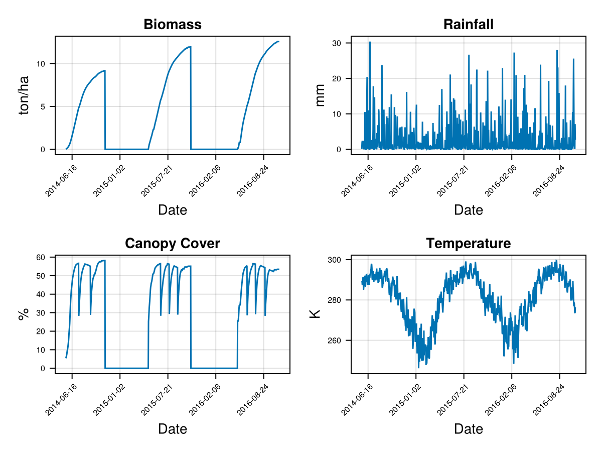

<!-- see documentation here: https://joss.readthedocs.io/en/latest/paper.html -->

<!-- set up a Github Action to auto-compile to PDF: https://github.com/marketplace/actions/open-journals-pdf-generator -->

# Summary

All agriculture is dependent on the growth of plants. Crop plants provide food
for humans, fodder for domestic animals, and fibre and other resources for our
manufacturing economy. Therefore, understanding how plants grow under different
conditions is important not just for farmers themselves, but also for the rest
of society. Crop models based on physical and physiological processes use information
about environmental parameters (e.g. temperature, rainfall, soil quality) and
knowledge of plant biology to simulate how crop plants grow over time and estimate
the resulting yield. Such models can be used to optimise farm management, 
forecast regional or national yields, or study climate change impacts.

# Statement of need

`AquaCrop.jl` is an independent Julia translation of the [AquaCrop](https://github.com/KUL-RSDA/AquaCrop/)
model (version 7.2), originally developed by the FAO [@Steduto2009]. This is a well-established 
crop growth model that has been used to model numerous crops worldwide [@Mialyk2024], 
and is known to produce reliable estimates of crop phenology and yield [@Kostkova2021].

`AquaCrop` is already available in multiple languages. First implemented in Delphi,
it was later open-sourced in a Fortran version [@deRoos2021; @RSDA2024]. There are
also versions available in [Matlab](https://github.com/aquacropos/aquacrop-matlab), 
[Python](https://github.com/aquacropos/aquacrop), and R, although these are not 
up-to-date with the most recent version of the original model [@Foster2017; @Kelly2021; @CamargoRodriguez2019]. 
With `AquaCrop.jl`, we want to expand this portfolio to make the model more easily 
accessible to the growing number of environmental modellers working with Julia.

Beyond just adding another language, our purpose is also to provide a package that
can be readily integrated into other scientific software. Recent research has 
emphasised the need for the creation of interdisciplinary models that consider
the multiple processes inherent in global challenges such as climate change or 
biodiversity loss [@Cabral2023]. This will require the use of model coupling, and the
adaptation of existing models to be usable as components in integrated models 
[@Vedder2024]. The new API we developed for `AquaCrop.jl` is intended to do just that.

Specifically, we developed the package to use it as a component within 
[Persefone.jl](https://persefone-model.eu), a model of agricultural ecosystems 
[@Vedder2024a]. The aim of this model is to study the impact that agricultural 
processes have on biodiversity, for which the growth of crop plants is an important 
mediating factor.

The core code of `AquaCrop.jl` closely follows the FAO's Fortran implementation, 
which allows us to quickly integrate changes and updates to the original `AquaCrop` 
code. On top of the core code, we have an API that makes it easy to upload data and 
run the simulations in several ways. This also enables exploring and interacting 
with state variables at run time, opening up the possibility of dynamic, bidirectional
model coupling. These new features increase the interoperability of the model compared
to its original implementation. In addition, they allow complementing the code with 
other libraries from the Julia ecosystem, like `DataFrames.jl`, `Makie.jl`, 
`StatsModels.jl`, or `Optimisers.jl`. All of this makes `AquaCrop.jl` a reliable 
and versatile tool for simulating and studying crop growth.

# Example 

The following tutorials are provided in the documentation:

- [Basic run](https://gabo-di.github.io/AquaCrop.jl/dev/gettingstarted/#basic_run_section) 
shows how to set up a model run using the original `AquaCrop` configuration file format, 
simulating a complete vegetation period.
- [Intermediate run](https://gabo-di.github.io/AquaCrop.jl/dev/userguide/#Intermediate-Run) 
shows how to use TOML and CSV files for the input data, how to make the simulation day by day, and how to get some variables of the cropfield at run time.
- [Advanced run](https://gabo-di.github.io/AquaCrop.jl/dev/userguide/#Advanced-Run) provides how to upload the data using Julia variables, it also shows how to update changes in the variables at run time. 

A simple demonstration of the basic run using the data from the `AquaCrop.jl/test/testcase` directory is shown here:,


```julia
using AquaCrop
using CairoMakie
using Unitful

runtype = NormalFileRun();
parentdir = AquaCrop.test_dir;  #".../AquaCrop.jl/test/testcase"

outputs = basic_run(; runtype=runtype, parentdir=parentdir);

f = Figure();
ax = Axis(f[1,1],
    title = "Biomass vs Day",
    xlabel = "Day",
    ylabel = "Biomass",
)
lines!(ax, 1:size(outputs[:dayout], 1) , ustrip.(outputs[:dayout][!, "Biomass"]))
```




Figure \autoref{fig:biomass}
shows how grows the Biomass as the simulation days passes. Note that in this test case is for 3 seasons.

# Acknowledgements

GDI, MM, and DV are funded through the project CAP4GI by the Federal Ministry of 
Education and Research (BMBF), within the framework of the Strategy, Research for 
Sustainability (FONA, www.fona.de/en) as part of its Social-Ecological Research 
funding priority, funding no. 01UT2102A. Responsibility for the content of this 
publication lies with the authors. MM, GP, and DV gratefully acknowledge the support 
of iDiv, funded by the German Research Foundation (DFG–FZT 118, 202548816).

# References
